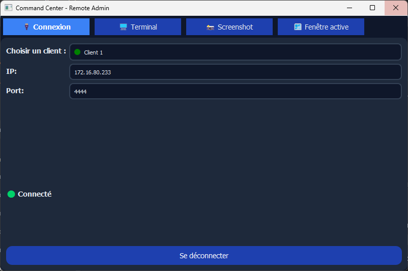

# Projet Backdoor
Created  by Théo BLANDIN | Benjamin AUBRY | Léa MANGOT | Louis TORCHET--MAILLARD

## Project explaination 
Ce projet a pour objectif de développer une backdoor en Python ciblant Windows, afin de démontrer les concepts avancés de programmation et de sécurité informatique.

L'objectif principal est d'explorer et de comprendre les mécanismes internes des systèmes d'exploitation, en mettant l'accent sur les vulnérabilités et les moyens d'exploitation que peuvent présenter ces systèmes. Ce projet vise à améliorer les compétences pratiques dans la cybersécurité, tout en fournissant une compréhension approfondie des risques associés à la sécurité informatique.

**Note importante :** Ce projet est exclusivement destiné à des fins éducatives. L'utilisation de ce code pour nuire à autrui est strictement interdite. Veuillez respecter les règlementationet les lois locales.

## Team members

#### Théo BLANDIN (Project Manager "PM")
- Recherches sur les backdoors
- Création du fichier main.py et client.py grâce aux premières recherches sur internet
- Initialisation d'une fenêtre admin pour le panel admin
- Amélioration du panel admin (UIX)
- Séparation du projet côté admin en plusieurs fichiers (arborescence optimisation)
- Amélioration de l'arborescence
- Ajout de plusieurs fonctionnalités
    - Capture d'écran
    - Exécution de plusieurs commandes Windows shell d'un coup grâce aux threads
    - Optimisation du fichier client.py pour permettre de réduire les ressources consommées pour le client
    - Aide au niveau de la fonctionnalité de Keylogger
#### Louis TORCHET--MAILLARD (Developer & assistant PM)
- Recherches sur les backdoors
- Premier jet des scripts client et server (base de la backdoor)
- Script de lancement d'installation Spotify et du script malveillant
- Connexion base de données
- Clé de registre pour la persistance
- Capture de la webcam
- Flux en direct de la webcam
- Readme
#### Benjamin AUBRY (Developer)
- Recherches sur les backdoors
- Suivi fenêtre active
- Design UI
- keylogger

#### Léa MANGOT (Develepor & editor)
- Recherches sur les backdoors
- Rédaction du compte rendu
- Recherches sur Windows
- Rédaction des compte rendu de réunion
- Rédaction du cahier des charges
  
## Context of the project

Dans le cadre de notre parcours de formation Bachelor 2 Cybersécurité à l'ESAIP, il nous est demandé de réaliser un projet en python.
Ce projet de backdoor s'inscrit dans une **démarche éducative** qui vise à approfondir nos connaissances en sécurité informatique, à identifier les failles exploitées par les hackers et à renforcer notre compréhension des concepts liés à la cybersécurité dans un environnement pratique.
Finalement, ce projet consitute un élément de notation pour notre groupe.

## Technical aspect

#### IDE used :
- Visual Studio Code

#### Programmation language :
- Python

#### Utils used:
- asyncio  
- cv2  
- os  
- psutil  
- pyautogui  
- PyQt5  
- socket  
- struct  
- subprocess  
- sys  
- threading  
- time  
- win32gui  
- win32process
  
## Features

- Execution de commandes bash
- Capture d'écran manuelle
- Capture de webcam manuelle
- Affichage de la fenêtre active
- Keylogger
- Persistance par clé de registre
- Installation de spotify et du script malveillant
- Discrétion de l'execution (en dev) 
## Illustration

